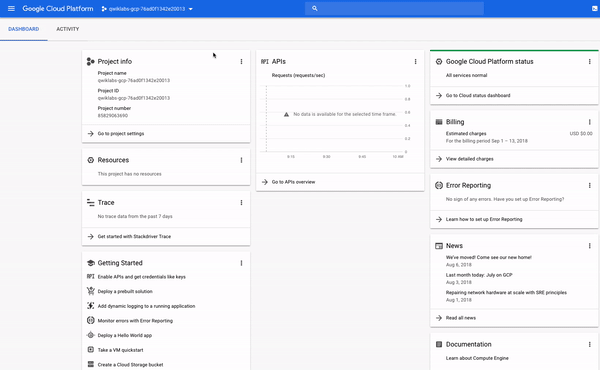

此系列紀錄在 Qwiklabs 平台學習使用 GCP（Google Cloud Platform）的過程。  
本次學習任務：[A Tour of Qwiklabs and the Google Cloud Platform](https://google.qwiklabs.com/focuses/2794?parent=catalog)
<!-- more -->

版本：2021/05/24

### 學習目標

- 認識 Qwiklabs 平台，並發掘重要功能。
- 學習如何使用特定憑證存取 Cloud Console。
- 認識 GCP 專案並了解常見錯誤。
- 學習如何使用 Google Cloud 導航選單來辨識 GCP 服務的類型。
- 認識 primitive roles，並使用 Cloud IAM 服務檢查特定使用者的可用操作。
- 認識 Cloud Shell 並使用 `gcloud` 工具組運行指令。
- 認識 API library 並瞭解主要功能
- 使用 Cloud Shell 中預裝的工具，運行 `touch`、`nano`和 `cat` 等指令來建立、編輯和輸出文件內容。

### Qwiklabs 基礎功能

#### Start Lab

點擊此按鈕會建立一個臨時 GCP 環境，並啟用所有必要的服務和憑證。當開始一個實驗時，會在新分頁中開啟環境（Google Cloud Console 界面）。

注意在開啟 Google Cloud Console 時要使用無痕模式

#### 時間

指定完成實驗所需的時間。點擊 **Start Lab** 按鈕時，計時器會開始倒計時。時間結束時，臨時 GCP 環境和資源會被刪除。若專心進行 lab，時間是充裕的。

#### 分數

有些實驗會包含一個分數。此功能稱為活動追蹤，可確保在實驗中完成指定的步驟。需要**按照順序**完成所有步驟才能通過並得到 credit。

### 存取 Cloud Console

點擊**開始實驗**後，需要一點時間生成 GCP 環境。準備完成後，左側窗格會出現打開 Google 控制台按鈕、憑證（使用者名稱和密碼）及專案 ID。  


<div markdown="span" class="info">**注意**：每次實驗都會產生一組全新的臨時憑證，並在結束實驗時失效。</div>

#### 打開 Google 控制台

點擊此按鈕可打開 [Cloud Console](https://cloud.google.com/cloud-console/)，是 GCP 的網絡控制台和開發中心。所有Google Cloud Qwiklabs 實驗都會以某種形式使用 Cloud Console。

#### 專案 ID

[GCP 專案](https://cloud.google.com/docs/overview/#projects)是組織 Google 雲端資源的實體。包含各種資源和服務，如 VM pool、資料庫以及連接它們的網路，還有一些設置和權限。

專案 ID 是一個唯一識別碼，用來連結 GCP 資源與特定專案的 API，整個 GCP 只會有唯一的 `qwiklabs-gcp-xxx...`。

#### 使用者名稱和密碼

這兩項共同代表著 Cloud IAM（Cloud Identity and Access Management，身分與存取管理）中的一種身分。具有特定訪問權限在被分配的專案中使用 GCP 資源。當倒計時結束時，臨時憑證將會失效，無法繼續存取專案。

### 登錄 GCP

1. 點擊**打開 Google 控制台**後，使用給予的臨時憑證登錄。

    <div markdown="span" class="warning">**注意**：開啟 Cloud Console 時請使用無痕模式開啟，並用實驗提供的臨時帳號密碼（`googlexxxxxx_student@qwiklabs.net`）登錄，以避免產生額外費用及留下臨時帳號紀錄。</div>

2. 接受服務條款及隱私權政策
3. 由於是臨時帳號，略過備援選項或兩階段驗證
4. 勾選同意服務條款並確認

完成後就會看到以下介面：  


### Cloud Console 中的專案

在中間偏左上有個**專案資訊**的面板：  

專案有名稱、ID 和編號，在使用 GCP 時會經常用到這些識別碼（identifiers）

部分實驗可能會提供多個專案來完成分配的任務。點擊標題列中專案名稱旁邊的下拉選單並選擇 **ALL**，會看到 **Qwiklabs Resources** 專案。


<div markdown="span" class="warning">此時暫時不要切換到 Qwiklabs Resources 專案。</div>

對於大型企業或經驗豐富的使用者，擁有數十到數千個 GCP 專案的情況很常見。因此可以通過專案來有效地整理雲端運算服務。

Qwiklabs Resources 是包含某些實驗的檔案、資料集和機器映像的專案，可透過 GCP 實驗環境存取。但 Qwiklabs Resources 是與所有 Qwiklabs 用戶共享的（唯讀），因此**無法刪除或修改**。

你目前使用的是一個臨時的 GCP 專案，在當前實驗結束後，專案內的所有內容將被刪除。每當開始新實驗，系統會授權使用一個或多個新的 GCP 專案（不是 Qwiklabs Resources），來執行實驗步驟。

### 導航選單與服務

點擊畫面左上角的 icon 來打開導航選單，可以透過該選單快速訪問 GCP 的核心服務：

GCP 有以下七類服務：

1. **Compute**：包含支援任何類型工作負載的多種機型。可透過不同運算選項，決定對操作細節和基礎架構的控制程度。
2. **Storage**：針對結構化或非結構化、關係型或非關係型資料提供資料儲存和資料庫選項。
3. **Networking**：平衡應用程式流量及及提供安全性規則的服務。
4. **Cloud Operations**：一套可以跨雲端記錄、監控及追蹤的工具。
5. **Tools**：幫助開發者管理部署及應用程式建置流水線的服務。
6. **Big Data**：處理和分析大型資料集的服務。
7. **Artificial Intelligence**：在 GCP 上運行特定 AI 和機器學習任務的 API 套件。

關於詳細說明，可查看 [About Google Cloud services](https://cloud.google.com/docs/overview/cloud-platform-services)。

### 查看角色與權限

在導覽選單中點擊 **IAM & Admin > IAM**，會跳到使用者列表的頁面，並列出授予特定帳號的權限及身分。

找到你登錄時使用的帳號名稱，Member 欄會顯示 `googlexxxxxx_student@qwiklabs.net`。Role 欄則會顯示 **Editor**，為 GCP 的三個基本角色之一，基本角色可設置專案層級權限，除非另外指定，否則這些角色控制所有 GCP 服務的存取和管理。


以下是從 [roles documentation](https://cloud.google.com/iam/docs/understanding-roles/#primitive%5C_roles) 節錄的基本角色介紹：

- **Viewer**：不影響狀態的唯讀權限，能查看但能不修改現有資源或資料。
- **Editor**：擁有 Viewer 的權限，以及新增、修改、刪除資源的權限，但不能在專案中新增或移除成員。
- **Owner**：擁有 Editor 的權限，並可以管理專案中的角色及權限及專案內所有資源，以及為專案設置結算。

### API 與服務

API（application programming interfaces，應用程式介面） 是 GCP 的重要部分。從商務管理到機器學習，提供 200 多個 API，這些 API 皆可與 GCP 專案及應用程式整合。

你可以直接呼叫（call） API，或透過用戶端函式庫呼叫。Cloud API 使用了 [API Design Guide](https://cloud.google.com/apis/design/) 中所述的資源導向設計原則。

當 Qwiklabs 提供新的 GCP 專案時，大部分的 API 會自動啟用以快速開始實驗。如果是在 Qwiklabs 之外建立專案，則需要手動開啟。

大多數 Cloud API 會提供 API 的詳細使用資訊，包括流量層級（traffic levels）、錯誤率、延遲等，幫助你快速替問題分類。

#### 查看可用 API

在導覽選單中點擊 **APIs & Services > Library**，搜尋  **Dialogflow API**，進入詳細頁面後點擊 **Enable** 啟用。


Dialogflow API 能讓你不用了解底層機器學習和自然語言模式（natural language schema）就能建置如 Google 助理等對話應用程式。點擊 **Try this API** 會在新分頁開啟說明文件。

想了解有關 API 的更多信息，可以前往 [Google APIs Explorer](https://developers.google.com/apis-explorer/)。也可以在 [APIs Explorer: Qwik Start](https://google.qwiklabs.com/catalog_lab/1241) 透過簡單的範例實際操作工具。

### Cloud Shell

說明文件：[How Cloud Shell works](https://cloud.google.com/shell/docs/features)

Cloud Shell 是瀏覽器內命令提示字元執行環境，能在終端機中輸入命令來管理 GCP 專案中的資源和服務。透過 Cloud Shell，可以無需離開控制台即可運行所有 shell 命令，並包含預載的命令列工具。

#### 啟動 Cloud Shell

在標題列點擊 **Activate Cloud Shell**，如果出現提示，點擊 **Continue** 繼續。

Cloud Shell 配置完成後，會出現以下訊息，表示成功啟動並運行 Cloud Shell：

```
Welcome to Cloud Shell! Type "help" to get started.
Your Cloud Platform project in this session is set to qwiklabs-gcp-76ad0f1342e20013.
Use "gcloud config set project [PROJECT_ID]" to change to a different project.
gcpstaging23396_student@cloudshell:~ (qwiklabs-gcp-76ad0f1342e20013)$
```

執行以下指令，如果出現提示，點擊 **Authorize**：

```
gcloud auth list
```

會出現類似以下的訊息，`ACTIVE ACCOUNT` 被設置為你的 Cloud IAM 身分（`gcpstagingxxxxx_student@qwiklabs.net`）

```
Credentialed Accounts
ACTIVE  ACCOUNT
*       gcpstaging23396_student@qwiklabs.net
To set the active account, run:
    $ gcloud config set account `ACCOUNT`
```

Cloud Shell 預載了特定的命令行工具。主要的 Google Cloud 工具組是 [gcloud](https://cloud.google.com/sdk/gcloud/)，用於資源管理、使用者身份驗證等。剛剛執行的是 `gcloud` 的 [`auth list`](https://cloud.google.com/sdk/gcloud/reference/auth/list) 指令，列出專案中有憑證的帳號。

除了預載的工具組，Cloud Shell 還附帶標準的 Unix CLI（command line interface，命令列介面）工具和文件編輯器，如 [nano](https://www.nano-editor.org/)。

#### 建立與編輯文件

使用 [`touch`](http://www.linfo.org/touch.html) 指令建立名為 `test.txt` 的文件，`touch` 指令不會有任何輸出：

```
touch test.txt
```

執行 Unix 指令 [`ls`](https://linuxconfig.org/learning-linux-commands-ls) 列出當前目錄內的所有檔案：

```
ls
```

得到下列輸出：

```
README-cloudshell.txt  test.txt
```

輸入 `nano` 加上檔案名稱來編輯檔案：

```
nano test.txt
```

會在 Nano 文字編輯器打開檔案：


輸入一段文字後，按 **CTRL + X** 離開編輯畫面，按 **Y** 確認，此時會詢問儲存的檔案名稱，不更改直接按 **ENTER** 即可。

`cat` 可以輸出檔案的內容：

```
cat test.txt
```

此時應該會輸出之前在 `test.txt` 輸入的內容。

### 結束實驗

點擊 **End Lab** 再點擊 **OK** 並給予評價即可。
